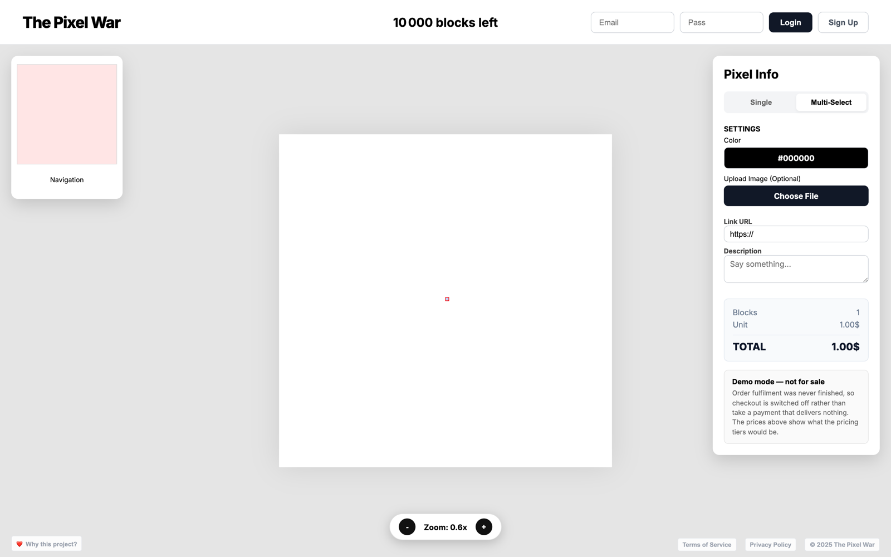

# The Pixel War

A 100×100 grid of 10 000 blocks where each block can carry a colour, an image, a link and a caption — the Million Dollar Homepage idea, rebuilt on Supabase and deployed on Vercel.

<p align="center">
  
</p>

Live: [the-pixel-war.vercel.app](https://the-pixel-war.vercel.app) — running in demo mode, see *Status*.

## Why I built it

I wanted to ship something end to end that had a database, authentication, file uploads and a payment flow, instead of another CRUD demo. Rebuilding the Million Dollar Homepage was a small enough idea that the interesting part was all the plumbing behind it: a canvas that redraws 10 000 cells at 60 fps, multi-block selection that slices one uploaded image across a rectangle, and row-level security so a pending block cannot be seen by anyone but its owner.

## Stack

- **React 18 + Vite** — a single `<canvas>` for the grid, a second one for the minimap, image cache keyed by URL
- **Supabase** — Postgres for the blocks, Auth for accounts, Storage for uploaded images, Edge Functions (Deno) for the server side
- **Stripe Checkout** — via a `create-checkout` Edge Function, **currently disabled** (see below)
- **Vercel** — hosting and deploys

An image dropped on a multi-block selection is stored once and sliced at draw time: each block records its own `img_ox`/`img_oy` offset inside the group, and the canvas draws the matching source rectangle. One upload, N blocks, no server-side image processing.

## How to run

```bash
npm install
cp .env.example .env    # fill in your Supabase project URL and publishable key
npm run dev
```

Both values in `.env` are public by design — they ship inside the browser bundle. The service-role key lives only in Supabase Edge Function secrets and never touches this repository.

## Status

**Demo mode: the payment flow is switched off, on purpose.**

The `stripe-webhook` Edge Function that was supposed to fulfil a paid order was never implemented — it is still the Supabase starter template, and it was deployed to production in that state. The checkout worked: it inserted the chosen blocks as `pending`, sent the buyer to Stripe, and Stripe redirected back to `/?success=true`. Nothing on the return path ever promoted those blocks from `pending` to `paid`. **A completed payment delivered nothing.**

Rather than leave a checkout that can take money and give nothing back, checkout is now disabled in two places: `CHECKOUT_ENABLED` in `src/App.jsx` hides the purchase button and refuses before writing anything, and `supabase/functions/create-checkout` returns 503. Turning it back on means implementing the webhook first — signature verification, `checkout.session.completed`, the `pending` → `paid` promotion under the service-role key, and idempotency on the Stripe event id.

Other things worth knowing:

- The Supabase project backing the live site is currently **paused**, so the deployed app loads an empty grid. The disabled `create-checkout` above could not be deployed for the same reason; it will take effect on the next deploy after the project resumes.
- The admin bypass ("Magic Add") is gated on an email compared **client-side**, which is a display-level check, not a security boundary. The real protection has to be a row-level security policy in Postgres.
- No test suite.

## License

MIT — see [LICENSE](LICENSE).
